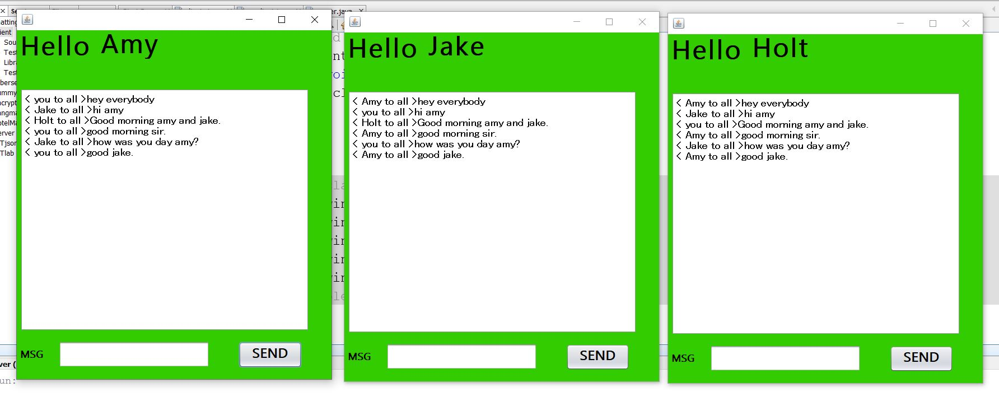
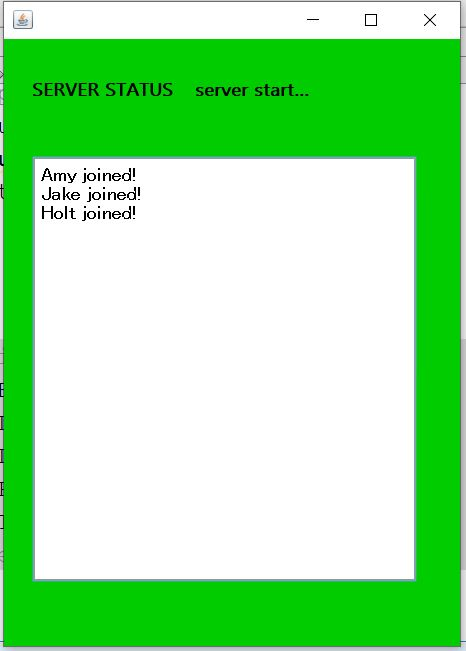

# Multi-Client-Chatting-Appliation
Multi client chatting application develloped using Java. Here users can interact to each other and share information to all others.
Here the server runs on a specific computer and has a socket that is bound to a specific port number and is waiting for client to make a connection. The client knows the hostname of the server machine that is running and the port number on which the server is listening.
After the socket is successfully made , the client can communicate with other clients.

Language - Core Java

Concepts - Socket Programming

IDE - Netbeans

